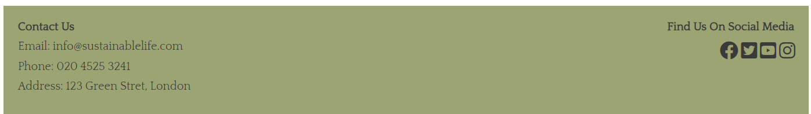

About Sustainable Life
----------------------

Sustainable Life is a website fully committed to promoting sustainable living practices in the UK. The website aims to encourage individuals to make small but effective changes in their daily lives that will have a positive impact on the environment.

Screenshots
-----------

User Stories
------------

As a first-time visitor, I expect to navigate through the site with ease and find comprehensive information on sustainable living practices that benefit the environment.

As a returning visitor, I expect to receive regular updates and articles on sustainable living practices that you can incorporate into my everyday life to help achieve sustainability.

As a frequent user, I expect to find contact information effortlessly for any questions or concerns I may have.

Design
------

Our website features a clean and modern design with a focus on sustainability. Its simple layout and ample white space enhance the readability and user experience of the site. The utilization of colours and imagery aligns with the brand's sustainable ethos and evokes an eco-friendly feel.

Color Scheme
------------

We incorporated natural earthy colours such as forest green (#00755e) and off-white (#f6f6f6) to stimulate a calm and harmonious environment that reflects the brand's sustainable values.

Typography
----------

The font 'Quattrocento Sans' used for all headings and subheadings, is sans-serif with clean lines, generating a minimalist and modern look for the website. The font choice for paragraphs is 'Quattrocento'. This easy-to-read font ensures readability and clarity.

Imagery
-------

The website incorporates images that align with the brand's sustainable ethos showing natural landscapes and sustainable living practices. The use of high-quality images throughout the site helps create an immersive and engaging user experience.

Features
--------

-   Fully Responsive Design - The website is designed to be responsive to a variety of devices, such as mobile phones, tablets, laptops, and desktop computers.

-   Interactive Navigation Menu - The easy-to-use navigation menu allows users to navigate around the site with ease. It features a hover effect to encourage users to interact and navigate through the website.

-   The "Welcome to Sustainable Life" feature highlights the main ways the website helps communities live more sustainably. The section includes four key areas: Tips, Volunteer, News, and Local Councils. This feature quickly establishes the website's aim to provide a comprehensive and useful resource for those interested in sustainable living.

-   The news section on the website showcases a specific news article that highlights the growing trend of community vegetable gardens in the UK. By including a recent article and updating it regularly, users can see that Sustainable Life is committed to staying up-to-date with the latest news and trends in sustainability. It also encourages users to return to see the latest news.

-   The "Tips" page provides a concise and actionable list of ways to reduce your carbon footprint and live an eco-friendly lifestyle. By offering suggestions that visitors can implement easily, this section showcases how small changes can make a big impact.
Screenshot of Tips Page

-   The volunteer page includes a form where users can sign up to volunteer in local sustainable projects. This page transforms the website from being purely informative to a website that encourages users to get involved, volunteer and make a positive impact on the world.

-   The footer section of Sustainable Life's website includes links to relevant social media sites, allowing users to easily navigate to them in a new tab. These links are valuable to the user, as they encourage them to stay connected with Sustainable Life through various social media platforms.

Languages, Tools & Technologies Used
------------------------------------

-   HTML5
-   CSS

##### Google Fonts

-   We sourced the fonts, 'Quattrocento Sans' and 'Quattrocento,' from Google Fonts.

##### Font Awesome

-   We integrated Font Awesome icons into the navbar to improve the user experience.

##### Git

-   We utilized Git for version control, allowing for easy 'commit' and 'push' commands through the terminal.

##### Github

-   The code was stored on Github for a seamless and collaborative workflow.

## Deployment

### GitHub Pages

#### To deploy the site through GitHub pages, follow these steps:

* Log in to GitHub and navigate to the GitHub Repository.

* Click on the gear icon for settings.

* Find the GitHub Pages section and click on the 'Check it out here!' link.

* Under the Source header, select 'main' from the dropdown menu and choose the folder '/ (root)'.

* Click on Save.

* After the page refreshes, locate the published website link found under the GitHub Pages header.

### Forking the GitHub Repository

#### If you wish to create a safe copy of the project to experiment with changes, follow these steps:

* Log in to GitHub and navigate to the GitHub Repository.

* Click the "Fork" button near the top of the page to create a copy of the repository.

### Making a Local Clone

* Under "Clone with HTTPS", click the clipboard icon to copy the link.

* Open Git Bash and change the current working directory to the location where you want the cloned directory.

* Type 'git clone', add a space, and paste the URL that was copied earlier (in step 4). Press enter to create a clone.

For a more detailed guide with screenshots, click [here.](https://docs.github.com/en/repositories/creating-and-managing-repositories/cloning-a-repository#cloning-a-repository-to-github-desktop)

## Content

All content written by Flora Jenner (Developer).

The example Code Institute Read Me file, which this Read Me file is based on.

## Media

All images were sourced from Unsplash - a site that provides images for free for commercial and non-commercial use.

## Validator Testing

Both the HTML5 and CSS3 code was put through WSC validators.

HTML5 passed with a warning that I decided was best not to change as it would have ment incorporating an unnecessary div element.

Css3 passed without errors.

Lighouse showed good scores.

## Future projects

Looking ahead, the vision for the website includes incorporating user-friendly sharing features, allowing our users to effortlessly share content.

## Credits

The navigation hover effect was modified from the code available at [codepen](https://codepen.io/Calloumi/pen/DyKMbj.)

The 4-column layout in the welcome section of the website drew inspiration from the example available at [W3 Schools](https://www.w3schools.com/howto/tryit.asp?filename=tryhow_css_four_columns_responsive.)

The grid layout was modified from defensive css [Defensive CSS](https://defensivecss.dev/tip/auto-fit-fill/) and [codepen](https://codepen.io/Calloumi/pen/DyKMbj.)

The volunteer signup form used some code snippets from [W3 Schools](https://www.w3schools.com/howto/howto_css_register_form.asp) as a reference.

The use of inspirational Hero images was inspired by the "Love running" walkthrough project by [The Code Institute.](https://codeinstitute.net/)

## Acknowledgements

My Mentor, Spencer Barriball, for his thoughtful and helpful feedback.

Tutor support at Code Institute for their support and assistance.